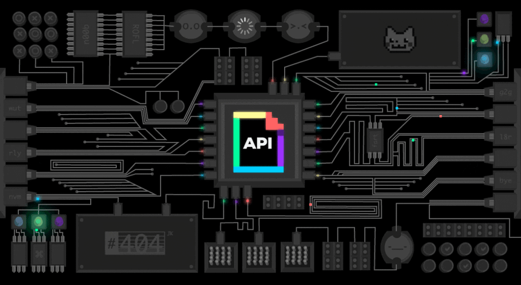

# 🛡️ BookGuard API — Smart Booking Conflict Manager

> 🚀 A powerful **Spring Boot REST API** that intelligently prevents overlapping bookings using precise **date-time conflict detection logic**.

<p align="center">
  
  
  
  
  
  
</p>

---

## 🌟 Overview

<p align="center">
  
</p>

**BookGuard API** is a backend service designed for **Smart Campus systems** 🏫  
It ensures **zero booking conflicts** by validating time slots before saving.

💡 Perfect for:

* 🏢 Room Booking Systems  
* 🧪 Lab Scheduling  
* 🎤 Conference Hall Reservations  

---

## ⚡ Key Features

✨ What makes this project powerful:

* 🛑 **Conflict Detection Engine** (real-time)
* 📅 Smart date-time validation
* 🧪 Dry-run conflict checking (no DB write)
* 🔍 Filter bookings (user, resource, upcoming)
* 📦 Clean layered architecture
* ⚠️ Standardized API error responses
* 🧠 Business logic separation (Service Layer)
* 🗄️ Dual DB support (H2 + MySQL)

---

## 🏗️ Tech Stack

| 🔹 Layer    | 🚀 Technology           |
| ----------- | ----------------------- |
| Language    | Java 17                 |
| Framework   | Spring Boot 3.2.5       |
| ORM         | Spring Data JPA         |
| Validation  | Jakarta Bean Validation |
| Database    | H2 / MySQL              |
| Build Tool  | Maven                   |
| Testing     | JUnit 5 + Mockito       |
| API Testing | Postman                 |

---

## 📁 Project Structure

```bash
src/main/java/com/bookguard/
├── controller/        # REST APIs 🌐
├── service/           # Business Logic 🧠
├── repository/        # DB Layer 💾
├── model/             # Entities 📦
├── dto/               # Data Transfer Objects 🔄
├── exception/         # Global Error Handling ⚠️
└── config/            # App Configurations ⚙️
```

---

## 🚀 Getting Started

### 🔧 Prerequisites

* Java 17+
* Maven 3.8+

---

### ▶️ Run the Project

```bash
git clone https://github.com/yourusername/bookguard-api.git
cd bookguard-api

./mvnw spring-boot:run
```

🌐 Server:

```
http://localhost:8080
```

---

### 🧪 H2 Database Console

```
http://localhost:8080/h2-console
```

| Field    | Value                   |
| -------- | ----------------------- |
| JDBC URL | jdbc:h2:mem:bookguarddb |
| User     | bookguard               |
| Pass     | bookguard123            |

---

## 🔌 API Endpoints

📍 Base URL:

```
/api/bookings
```

| Method | Endpoint          | Description      |
| ------ | ----------------- | ---------------- |
| POST   | `/`               | ➕ Create booking |
| GET    | `/`               | 📋 Get all       |
| GET    | `/{id}`           | 🔍 Get by ID     |
| GET    | `/resource/{id}`  | 🏢 By resource   |
| GET    | `/user/{name}`    | 👤 By user       |
| GET    | `/upcoming`       | ⏳ Upcoming       |
| GET    | `/check-conflict` | 🧪 Check only    |
| DELETE | `/{id}`           | ❌ Delete         |
| GET    | `/health`         | 💚 Health check  |

---

## 🧠 Conflict Detection Logic

💡 Core rule:

```
newStart < existingEnd  &&  newEnd > existingStart
```

### ❌ Conflict

```
10:00 ───────── 12:00
      11:00 ───────── 13:00
      🔴 OVERLAP
```

---

### ✅ No Conflict

```
10:00 ───────── 12:00
                12:00 ───── 13:00
                🟢 SAFE
```

---

## ✅ Validations

* 📌 Resource format → `ROOM-101`, `LAB-205`
* 👤 Username → 2–50 characters
* ⏰ Start must be future
* ⏱ End > Start
* 🕒 Duration → 15 mins – 8 hrs
* 🚫 No overlaps allowed

---

## ⚠️ Error Response Format

```json
{
  "success": false,
  "message": "Booking Conflict Detected ❌",
  "error": "'ROOM-101' already booked",
  "timestamp": "2026-05-06T10:30:00"
}
```

---

## 🧪 Postman Example

### Create Booking

```json
POST /api/bookings

{
  "resourceId": "ROOM-101",
  "userName": "Lithira",
  "title": "Project Meeting",
  "startTime": "2026-05-10T10:00:00",
  "endTime": "2026-05-10T12:00:00"
}
```

---

## 🗄️ Database Setup

### 🔹 Dev (H2)

✔ No setup required

---

### 🔹 Production (MySQL)

```sql
CREATE DATABASE bookguard;
```

```properties
spring.datasource.url=jdbc:mysql://localhost:3306/bookguard
spring.datasource.username=root
spring.datasource.password=yourpassword
```

---

## 👨‍💻 Author

**Lithira Liyanage**

🚀 Passionate about Backend Development & APIs

---

<p align="center">
  💙 Built with Passion | Spring Boot 💙
</p>
